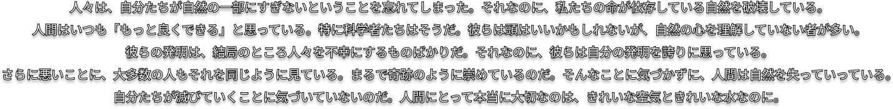

  

## ₍^. .^₎⟆

✦ Every now and then I code, though  my page is empty for now. Perhaps something will appear soon.

✦ Focused on cryptography and cryptanalysis

## What I use
<code></code>
<code></code>
<code></code>
<code></code>
<code></code>
